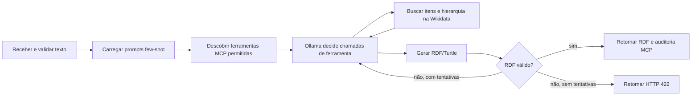

# Fluxo de criação do grafo

Este documento resume a fronteira operacional da abordagem `ontology-based`.

## Fronteira da ablação

- O texto não passa por uma etapa local de extração de menções.
- O modelo escolhe quando e com quais argumentos consultar as ferramentas.
- A aplicação permite somente busca de itens e hierarquia de instância/subclasse.
- Declarações genéricas, relações diretas e SPARQL não fazem parte do perfil padrão.
- A aplicação executa o transporte MCP, registra a auditoria e valida o RDF.

O diagrama detalhado da interação está em `docs/seq/analyze.puml`.
